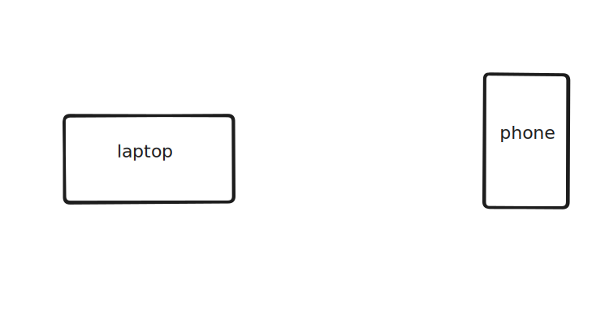
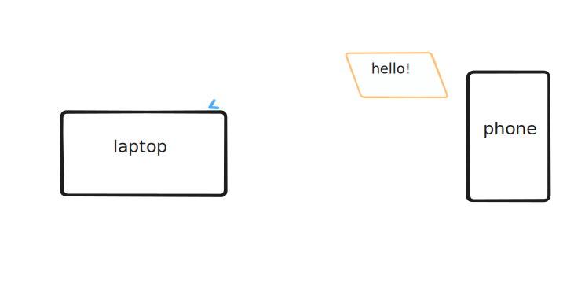
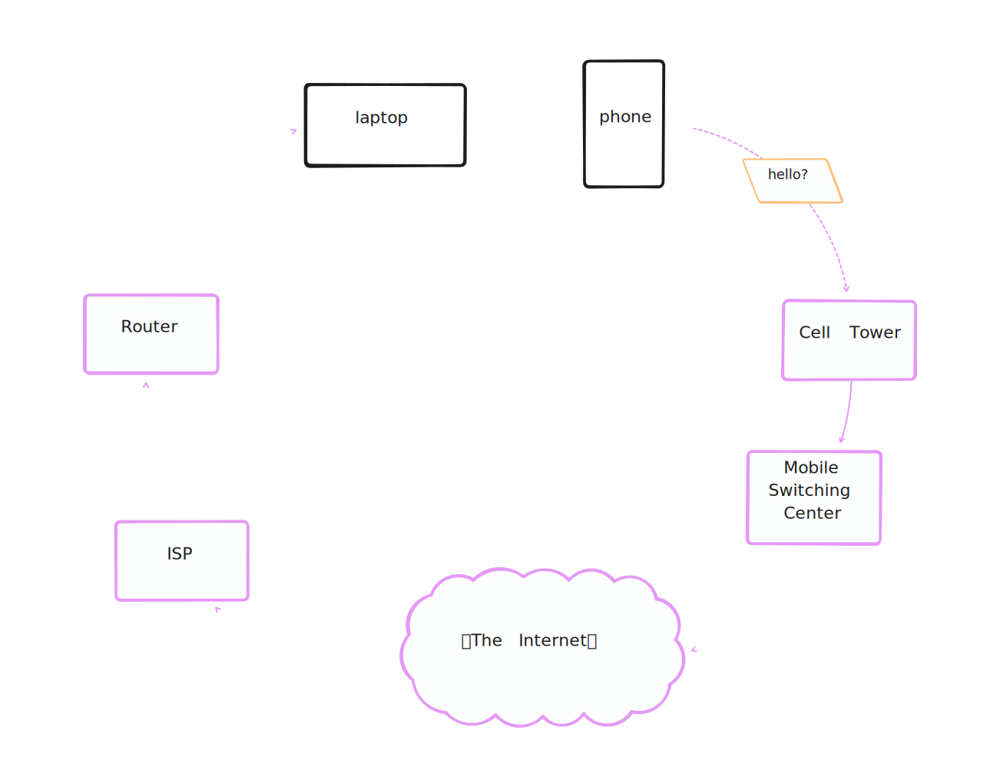
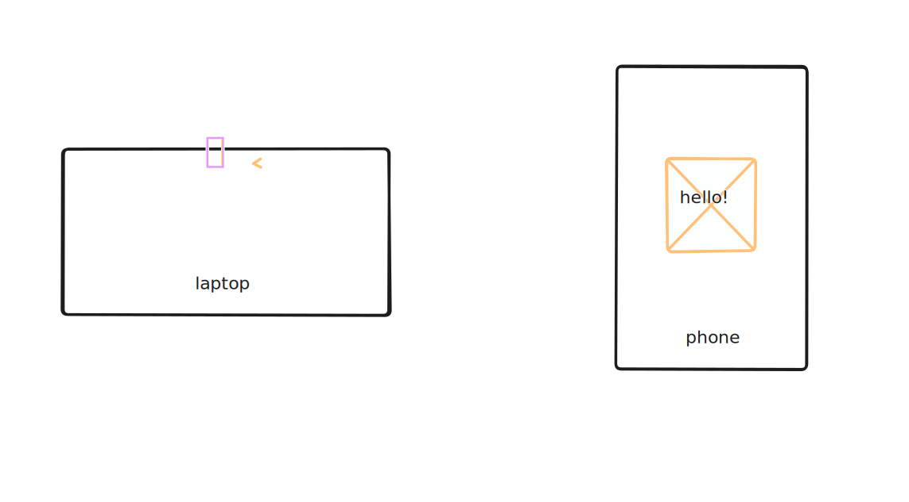
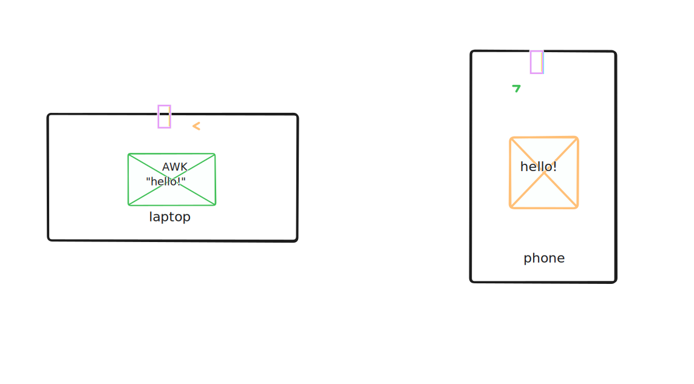
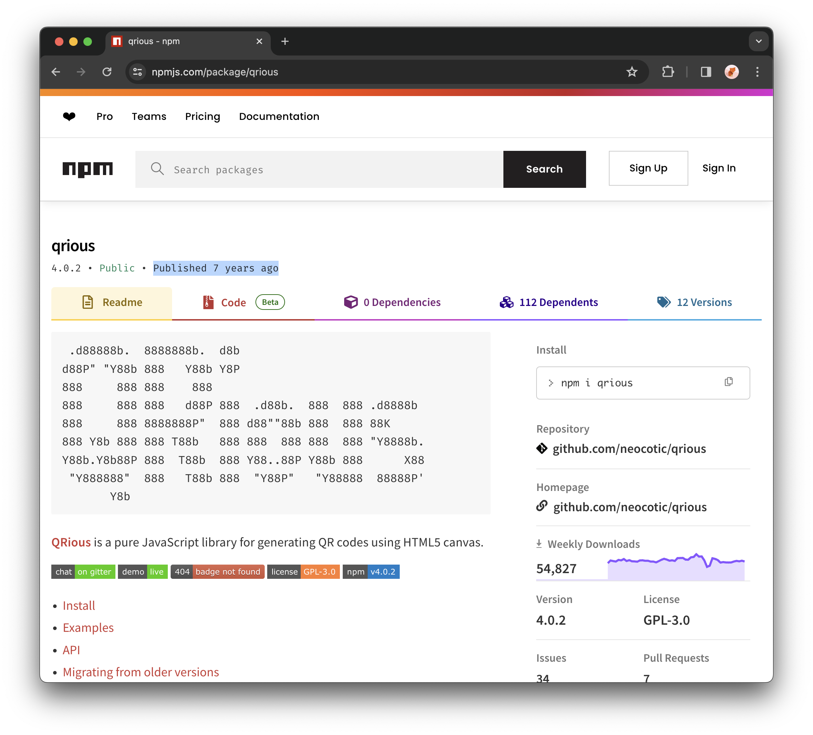
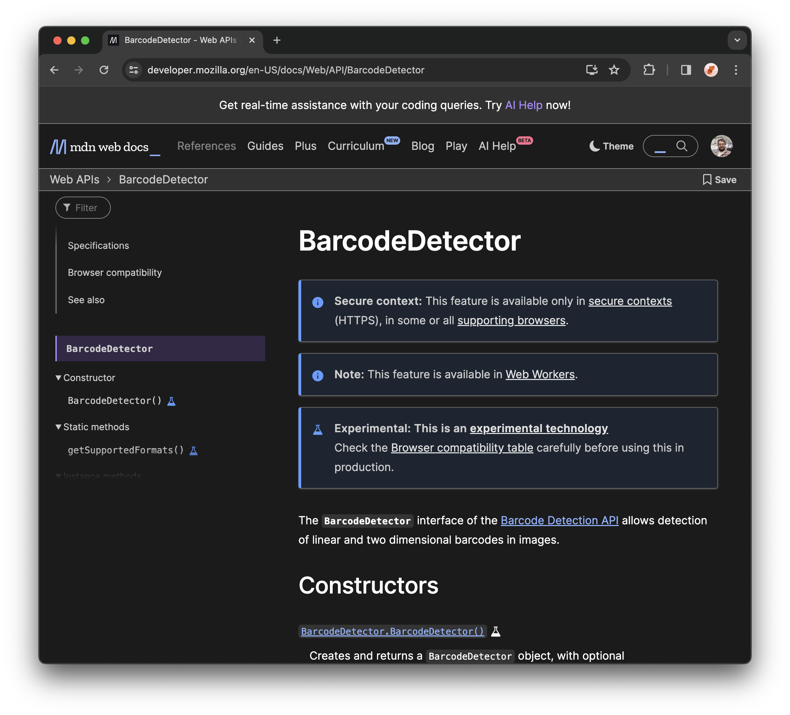

# 'Sup FOC

---



---



---



---



---



---

How to build this

---





---

```js
// Show a QR Code
new QRious({
  element: this.element.querySelector(`#qrcode`),
  value: "https://your-cool-site.com",
});

// --- other device ---

// Read a QR Code
const detector = new BarcodeDetector({
  formats: ["qr_code"],
});

for (const code of detector.detect(image)) {
  alert(code.rawValue); // "https://your-cool-site.com"!
}
```

---

```js
// Show a QR Code
new QRious({
  element: this.element.querySelector(`#qrcode`),
  value: '["foo", "bar"]',
});

// --- other device ---

// Read a QR Code
const detector = new BarcodeDetector({
  formats: ["qr_code"],
});

for (const code of detector.detect(image)) {
  alert(code.rawValue); // "[\"foo\", \"bar\"]!
}
```

---

the "protocol"

# [fit] `[RX, TX, MESSAGE]`

---

# 👀

[Sending messages](https://remotehack.space/QR-TX/?demo=send)

[Speed test](https://remotehack.space/QR-TX/?demo=speed)

[Chat](https://remotehack.space/QR-TX/?demo=chat)

[qRPC](https://remotehack.space/QR-TX/?demo=rpc)

[Signalling](https://remotehack.space/QR-TX/?demo=signalling)

---

# remotehack.space/QR-TX

(chrome/android only currently)
